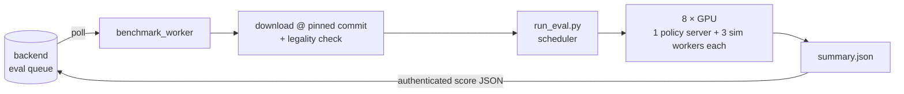

<div align="center">

# OpenRoboto Validator

**Parallel LIBERO evaluation for the OpenRoboto subnet — the harness behind the leaderboard.**


-success)


[Website](https://www.openroboto.ai) · [Leaderboard](https://www.openroboto.ai/#/benchmark) · [Queue](https://www.openroboto.ai/#/queue) · [How the subnet works](https://github.com/openroboto-ai/openroboto-subnet/blob/main/docs/SUBNET_OVERVIEW.md) · [中文文档](./README_zh.md)

</div>

---

Point it at a model — a local checkpoint directory, a Hugging Face repo id, or an HF URL — and it evaluates the model on LIBERO task suites in MuJoCo, fanned out across 8 GPUs (one policy server per GPU, tasks dispatched dynamically). This is the code the subnet's benchmark worker runs: submissions picked up from the public evaluation queue are scored here.

Supported checkpoint formats, detected automatically: **openpi JAX** (`params/`, orbax OCDBT), **openpi PyTorch** (`model.safetensors`), and native **OpenVLA-OFT** sharded checkpoints (served by a dedicated policy server, never force-converted into an incompatible architecture).

## Verified against the official numbers

The pipeline follows openpi's official `examples/libero` protocol exactly — 180° image rotation, resize-pad to 224, replanning every 5 steps, the official fixed initial state per episode, seed 7 — so results are directly comparable to published numbers. Measured on 8×4090, 40 tasks × 10 trials:

| suite | JAX | PyTorch | official reference (50 trials, JAX) |
|---|---|---|---|
| libero_spatial | 99.0% | 100.0% | 98.8% |
| libero_object | 98.0% | 99.0% | 98.2% |
| libero_goal | 99.0% | 96.0% | 98.0% |
| libero_10 | 93.0% | 92.0% | 92.4% |
| **total** | **97.2%** | **96.8%** | **96.85%** |
| wall clock | 447 s | 527 s | — |

The two inference backends differ by 0.4% (2 of 400 episodes), within 10-trial noise. A full round-trip through Hugging Face (upload → download → evaluate) reproduces 96.5–96.8%, confirming the transport is lossless.

## What keeps an evaluation honest

- **Every run pins an exact HF commit.** `--commit-id` (full 40-hex) is mandatory; downloads are cached per commit, so re-pushing a repo can never be served from a stale cache.
- **Models are checked before they touch a GPU.** `libero_eval/check_model.py` (pure stdlib) validates checkpoint structure, safetensors/orbax integrity (truncated uploads, stray git-lfs pointers), architecture match against pi0.5 (parameter tree, projection shapes, total parameter count), and normalization stats. Illegal models are rejected with itemized reasons, exit code 3, zero GPU time spent.
- **Downloads can't be silently corrupted.** Model fetches run through a fallback strategy chain (mirror + aria2c, then official hub) and finish with a sha256 verification pass against official file metadata.
- **Infrastructure failures are never charged to the model.** If the worker hits a CUDA/EGL driver fault mid-run, the task is re-queued without submitting partial scores.

## Anti-overfitting design

LIBERO's demonstrations are public, so a model can score well by memorizing them. The harness ships two perturbation benchmarks to measure — and the subnet to punish — exactly that:

- **LIBERO-Pro** (`--benchmark libero_pro`, [arXiv:2510.03827](https://arxiv.org/abs/2510.03827)): the 4 base suites × 4 perturbation dimensions = 16 suites. Measured on the official pi0.5 checkpoint:

  | perturbation | mean success |
  |---|---|
  | `_lan` — semantic rephrasing of the instruction | 97.5% |
  | `_object` — object replacement (appearance/size) | 88.3% |
  | `_swap` — object positions shuffled, instruction unchanged | **25.8%** |
  | `_task` — task goal redefined | **25.0%** |

  Rewording costs the model almost nothing while position swaps collapse it — memorized behavior does not transfer. The production worker profile (`libero_pro_custom_1`) runs the same 16 suites and double-weights the two swap suites in the total score.

- **LIBERO-plus** (`--benchmark libero_plus`, [arXiv:2510.13626](https://arxiv.org/abs/2510.13626)): the 40 base tasks expanded into 10,030 variants across 7 robustness dimensions (camera viewpoint, robot init state, sensor noise, language, object layout, lighting, background textures). Official protocol: 1 rollout per variant; a full pass takes 7–10 h on 8×4090.

- **Mixed initial states** (`--init-seed N`): half of each task's trials use the official init states, half use inits re-sampled from the given seed. The subnet passes each queue entry's seed here — a value derived from the commitment block hash and the drand beacon, so it is public, verifiable, and unknowable before submission. Details in [docs/init_state_randomization.md](./docs/init_state_randomization.md).

## Architecture



The scheduler locks its GPUs exclusively (overlapping runs fail fast), dispatches long tasks first to avoid a stragglers' tail, and runs 3 evaluation workers per GPU sharing one policy server — while one worker's MuJoCo env simulates on CPU, another's inference uses the GPU (~1.8× throughput on a 4090). Three separate Python environments are involved (scheduler, openpi policy server, Python 3.8 LIBERO client); `setup.sh` builds them all.

## Quick start

```bash
git clone https://github.com/openroboto-ai/openroboto-evaluation && cd openroboto-evaluation
bash setup.sh --with-checkpoint     # one-time; also downloads a 12.4 GB demo checkpoint

# Evaluate an HF model, pinned to an exact commit
uv run libero_eval/run_eval.py \
    --model your-name/pi05-libero-finetuned \
    --commit-id 0123456789abcdef0123456789abcdef01234567 --num-trials 10

# Perturbation benchmark (16 suites)
uv run libero_eval/run_eval.py \
    --model ~/.cache/openpi/openpi-assets/checkpoints/pi05_libero \
    --commit-id local --benchmark libero_pro --num-trials 10

# Run as the subnet's benchmark worker (polls the queue, scores, reports back)
uv run benchmark_worker/worker.py --backend-url http://localhost:8001 \
    --benchmark libero_pro_custom_1 --num-trials 50
```

Each run writes `eval_runs/<run>/` with `summary.json` (total + per-suite success rates + per-task detail), per-task result JSONs, logs, and sampled rollout videos.

## Benchmarks at a glance

| `--benchmark` | What it runs | Scale | Default trials |
|---|---|---|---|
| `libero` (default) | Original LIBERO, 4 suites | 40 tasks | 10 (official protocol: 50) |
| `libero_pro` | LIBERO-Pro perturbations, 16 suites | 160 tasks | 10 |
| `libero_pro_custom_1` | Same 16 suites; swap suites double-weighted in scoring | 160 tasks | 50 (worker profile) |
| `libero_plus` | LIBERO-plus robustness variants | 10,030 tasks | 1 (official protocol) |

## Digging deeper

The [Chinese README](./README_zh.md) is the full engineering log and goes well beyond this page: JAX→PyTorch conversion, the download strategy chain, batched policy serving, GPU driver deadlock recovery, and per-benchmark implementation notes. If you work on the harness itself, read that one.

Related repositories: [openroboto-ai/openroboto-subnet](https://github.com/openroboto-ai/openroboto-subnet) (miner CLI, protocol, subnet docs) · [openpi](https://github.com/Physical-Intelligence/openpi) · [LIBERO](https://github.com/Lifelong-Robot-Learning/LIBERO)
